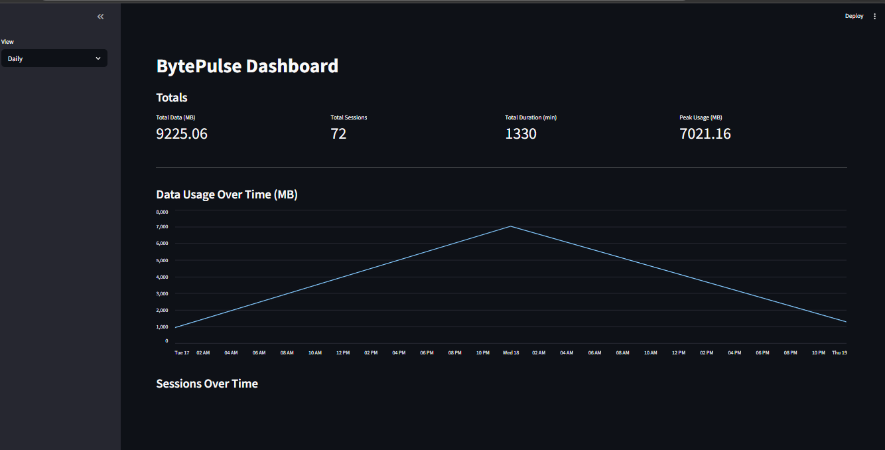
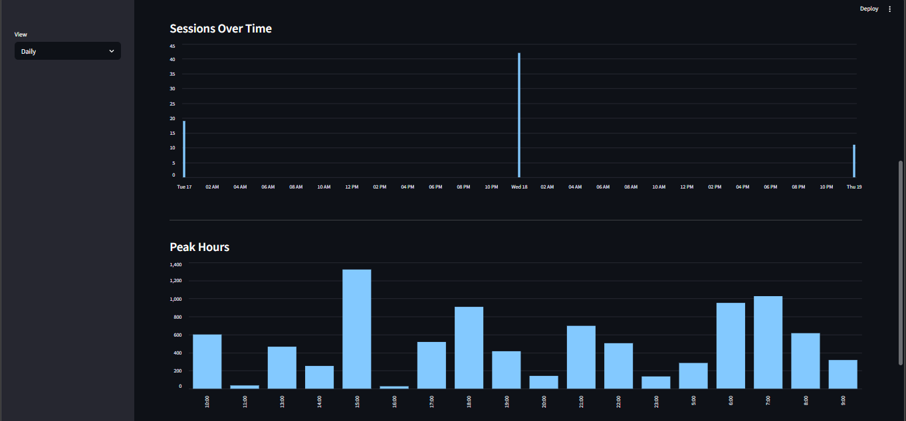

# BytePulse

> See exactly how your internet data is used — track every WiFi session, detect heavy usage, and visualize patterns locally with zero tracking

---

## What It Does

BytePulse runs silently in the background on Windows. Every time you connect to WiFi, it starts tracking your data usage and saves sessions to a CSV and JSON file at regular intervals — no cloud, no subscriptions, just clean local data.

---

## Features

- Automatic WiFi detection and session tracking
- Logs bytes sent, received and total usage
- Configurable save interval (default: 30 minutes)
- Runs invisibly on Windows startup via Startup folder
- Dual output — CSV and JSON, both ready for analysis, visualization, or aggregation
- JSON atomic writes — no corruption on crash or forced shutdown
- Duplicate instance prevention via lock file
- Handles interface changes, counter rollovers, and disconnects gracefully
- Streamlit dashboard with daily, weekly, and monthly summaries
- Peak hour analysis and usage trend charts

---

## Requirements
- Windows 10/11
- [Python 3.11](https://www.python.org/downloads/release/python-3110/) — check **"Add Python to PATH"** during install

> ⚠️ **Important:** `psutil` has known compatibility issues with Python versions above 3.11. Use Python 3.11 specifically to avoid installation or runtime errors.

---

## Getting Started

### 1. Clone the repo
```bash
git clone https://github.com/mosesamwoma/BytePulse.git
cd BytePulse
```

### 2. Install dependencies
```bash
pip install -r requirements.txt
```

### 3. Set up launcher files

- Copy `start_tracker.example.bat` → rename to `start_tracker.bat`, open in Notepad and replace `C:\path\to\BytePulse` with your actual folder path
- Copy `run_hidden.example.vbs` → rename to `run_hidden.vbs`, do the same

> 💡 **To find your path:** Open File Explorer, navigate to the BytePulse folder, click the address bar — it will show something like `C:\Users\YourName\Documents\BytePulse`. Copy that.

In `start_tracker.bat`, the line to update looks like this:
```bat
cd /d "C:\Users\YourName\Documents\BytePulse"
```

In `run_hidden.vbs`, the line to update looks like this — only change the path in the middle, leave the `chr(34) &` parts exactly as they are:
```vbs
WshShell.Run chr(34) & "C:\Users\YourName\Documents\BytePulse\start_tracker.bat" & chr(34), 0
```

> 💡 To see file extensions while renaming: open any folder → **View** tab → check **File name extensions**. This prevents accidentally saving as `.bat.bat` or `.vbs.vbs`.

### 4. Run manually to test
```powershell
.\start_tracker.bat
```

You should see:
```
[16:34:51] Tracker started (30-minute auto-save)
[16:34:51] Connected: Wi-Fi
```

After 30 minutes check `data/usage_log.csv` — a row should appear.

### 5. Run silently on startup

1. Press `Win + R`, type `shell:startup`, click OK

> 💡 **Win + R** — hold the Windows logo key and tap R. A small Run box appears at the bottom-left of your screen.

2. Copy `run_hidden.vbs` into that folder
3. Restart your PC

To confirm it's running after restart:
```powershell
Get-Process python
```

---

## Dashboard

Run the Streamlit dashboard to visualize your usage data:
```bash
streamlit run app.py
```

Opens at `http://localhost:8501`. Switch between daily, weekly, and monthly views from the sidebar.





---

## Output Files

Both files are saved in the `data/` folder and stay in sync — if one write fails, the other preserves the data.

### CSV — `data/usage_log.csv`

| start_time | end_time | duration_minutes | bytes_sent | bytes_received | total_bytes | usage_MB |
|---|---|---|---|---|---|---|
| 2026-03-17 16:34:51 | 2026-03-17 16:35:56 | 1.0873 | 886606 | 1629334 | 2515940 | 2.3993 |

### JSON — `data/usage_log.json`
```json
[
  {
    "start_time": "2026-03-17 16:34:51",
    "end_time": "2026-03-17 16:35:56",
    "duration_minutes": 1.0873,
    "bytes_sent": 886606,
    "bytes_received": 1629334,
    "total_bytes": 2515940,
    "usage_MB": 2.3993
  }
]
```

> ⚠️ **Do not open `usage_log.csv` in Excel while the tracker is running.** This locks the file and causes save failures. To view data safely, copy the file first:
> ```powershell
> copy "data\usage_log.csv" "%USERPROFILE%\Desktop\usage_copy.csv"
> ```

---

## Configuration
```python
POLL_INTERVAL = 5          # seconds between WiFi checks
AUTO_SAVE_INTERVAL = 1800  # seconds between saves — 1800 = 30 min
```

---

## Stopping the Tracker
```powershell
Stop-Process -Name python -Force
```

---

## Limitations

- Windows only — no Linux or macOS support
- WiFi only — Ethernet and mobile hotspot not tracked
- No per-app tracking or per-SSID tracking (total usage only)
- Requires Python 3.11 specifically
- Opening CSV in Excel while tracker runs may cause save failures

---

## Future improvements

- [ ] Data cap alerts
- [ ] Per-SSID tracking
- [ ] Anomaly detection
- [ ] Hourly heatmap
- [ ] Enhanced visualizations
- [ ] Task Scheduler integration
- [ ] System tray icon
- [ ] Cross-platform support

---