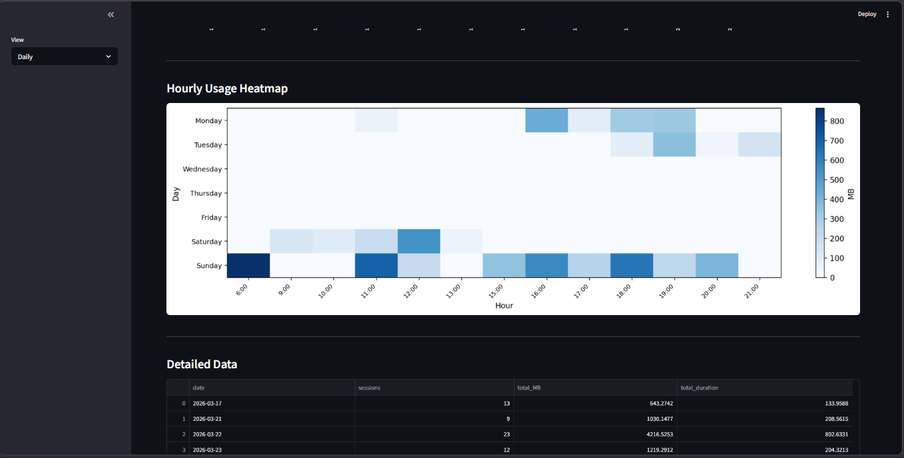
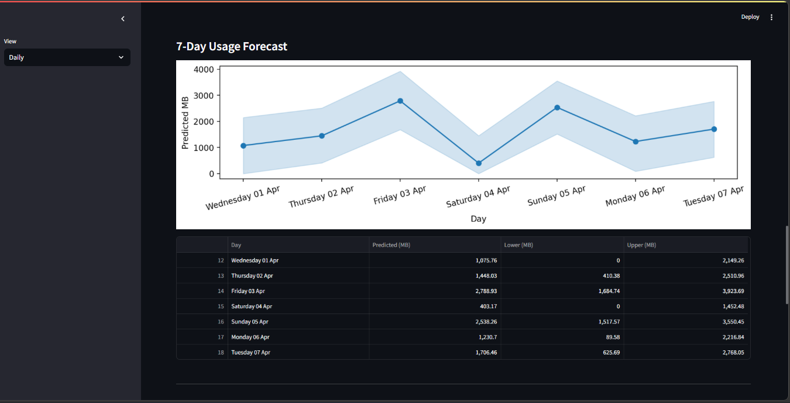
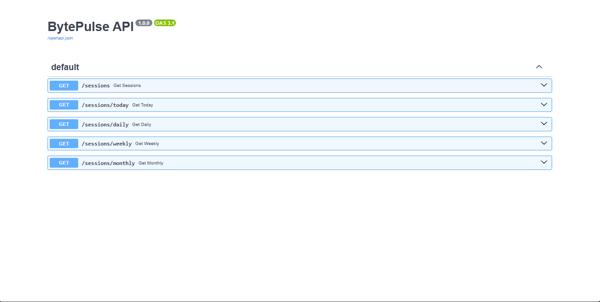

# BytePulse

**See exactly how your internet data is used — locally, silently, and privately.**

Track every WiFi session, detect heavy usage, and visualize patterns with zero cloud involvement.

---

## Overview

BytePulse runs silently in the background. Every time you connect to WiFi, it starts tracking your data usage and saves sessions to a local CSV, JSON, and SQLite database at regular intervals.

No cloud. No subscriptions. No tracking. Just clean local data that belongs to you.

**What it tracks:**

| Field | Description |
|---|---|
| `start_time` / `end_time` | Session timestamps |
| `duration_minutes` | How long you were connected |
| `bytes_sent` / `bytes_received` | Raw transfer counts |
| `usage_MB` | Total data used per session |

---

## Features

- **Silent background tracking** — runs at login via Windows Task Scheduler, no terminal window
- **Triple-format logging** — every session saved to CSV, JSON, and SQLite simultaneously
- **Atomic writes** — temp-file-swap pattern prevents data corruption on crash
- **Fault tolerance** — if CSV is locked (e.g. open in Excel), data falls back to a `.pending` file and merges on next run
- **System tray icon** — right-click to open dashboard, stop tracker, or quit
- **Streamlit dashboard** — daily, weekly, and monthly views with hourly heatmap
- **Anomaly detection** — flags sessions with unusually high usage via Z-score
- **Data cap alerts** — Windows toast notifications at 80% and 100% of your daily cap
- **7-day usage forecast** — Prophet-powered time series forecasting
- **REST API** — query your usage data as JSON via FastAPI

---

## Requirements

- Windows 10 or 11
- [Python 3.11](https://www.python.org/downloads/release/python-3110/) — check **"Add Python to PATH"** during install

> ⚠️ `psutil` has known compatibility issues with Python versions above 3.11. Use **Python 3.11 specifically** to avoid installation or runtime errors.

---

## Getting Started

### 1. Clone the repo
```bash
git clone https://github.com/mosesamwoma/BytePulse.git
cd BytePulse
```

### 2. Install dependencies

**Option A: Using pyproject.toml (recommended)**
```bash
pip install -e .
```

**Option B: Using requirements.txt**
```bash
pip install -r requirements.txt
```

> 💡 The `-e` flag installs in editable mode, so code changes take effect immediately without reinstalling.

### 3. Configure the launcher

Copy `start_tracker.example.bat` and rename it to `start_tracker.bat`. Open it in Notepad and replace the placeholder path with your actual BytePulse folder path:
```bat
cd /d "C:\Users\YourName\BytePulse"
```

> 💡 **Finding your path:** Open File Explorer, navigate to the BytePulse folder, and click the address bar — it shows the full path (e.g. `C:\Users\YourName\BytePulse`).

> 💡 **Seeing file extensions:** Open any folder → **View** tab → check **File name extensions**. This prevents accidentally saving as `start_tracker.bat.bat`.

### 4. Run manually to test
```powershell
.\start_tracker.bat
```

A BytePulse icon appears in the system tray. Right-click to open the dashboard, stop the tracker, or quit.

After 30 minutes, check `data/usage_log.csv` — a row should appear. Confirm the tracker is running:
```powershell
Get-Process pythonw
```

You should see exactly **two** `pythonw` processes (tracker + tray).

### 5. Enable silent startup

BytePulse uses Windows Task Scheduler to launch at login with no visible window.

**Step 1 — Get your paths.** Run this in PowerShell:
```powershell
(Get-Command pythonw).Source
```

This gives you your `pythonw.exe` path. Your BytePulse folder path you already know (it's where you cloned the repo).

**Step 2 — Register the tasks.** Open **PowerShell as Administrator** (`Win + S` → `powershell` → right-click → **Run as administrator**) and paste this, replacing the two variables at the top:
```powershell
# ── UPDATE THESE TWO LINES ───────────────────────────────────────────────────
$base    = "C:\Users\YourName\BytePulse"                                            # ← your BytePulse folder
$pythonw = "C:\Users\YourName\AppData\Local\Programs\Python\Python311\pythonw.exe"  # ← from step 1
# ─────────────────────────────────────────────────────────────────────────────

$trigger  = New-ScheduledTaskTrigger -AtLogOn
$settings = New-ScheduledTaskSettingsSet -AllowStartIfOnBatteries -DontStopIfGoingOnBatteries -ExecutionTimeLimit (New-TimeSpan -Seconds 0) -MultipleInstances IgnoreNew

Register-ScheduledTask -TaskName "BytePulse-Tray" `
    -Action (New-ScheduledTaskAction -Execute $pythonw -Argument "`"$base\src\tray.py`"" -WorkingDirectory $base) `
    -Trigger $trigger -Settings $settings -RunLevel Highest -Force

$triggerTracker       = New-ScheduledTaskTrigger -AtLogOn
$triggerTracker.Delay = "PT10S"
Register-ScheduledTask -TaskName "BytePulse-Tracker" `
    -Action (New-ScheduledTaskAction -Execute $pythonw -Argument "-m src.tracker" -WorkingDirectory $base) `
    -Trigger $triggerTracker -Settings $settings -RunLevel Highest -Force
```

Confirm both registered:
```powershell
Get-ScheduledTask -TaskName "BytePulse-Tracker"
Get-ScheduledTask -TaskName "BytePulse-Tray"
```

Both should show `State: Ready`. Restart your PC — BytePulse starts automatically.

### 6. Migrate existing data to SQLite

If you have existing CSV data, run this once to sync it to the database:
```bash
python -m scripts.migrate_csv_to_db
```

---

## Dashboard
```bash
streamlit run app.py
```

Or right-click the system tray icon → **Open Dashboard**. Opens at `http://localhost:8501`.

Switch between **daily**, **weekly**, and **monthly** views from the sidebar. The **hourly heatmap**, **7-day forecast**, **anomaly detection**, and **data cap** sections are available in the daily view.




---

## ML — 7-Day Usage Forecast

BytePulse uses **Prophet** (Meta's time series forecasting library) to predict your WiFi usage for the next 7 days based on your historical session data.

**How it works:**
- Aggregates your session data into daily totals
- Fits a Prophet model with weekly seasonality
- Predicts `usage_MB` for the next 7 days with upper and lower confidence bounds

**What you get:**
- A line chart showing predicted daily usage with confidence band
- A table with `Day`, `Predicted (MB)`, `Lower (MB)`, and `Upper (MB)` per day
- Visible in the dashboard under the **Daily** view

**Why it's useful:**
- See which days of the week you consistently use more data
- Get early warning before hitting your daily cap
- Understand your usage patterns over time

The model retrains automatically every time the dashboard loads — no manual steps needed.



---

## API

BytePulse includes a FastAPI-powered REST API that serves your usage data as JSON.
```bash
uvicorn api.main:app --reload
```

Opens at `http://localhost:8000/docs`.

| Endpoint | Description |
|---|---|
| `GET /sessions` | All sessions |
| `GET /sessions/today` | Today's sessions |
| `GET /sessions/daily` | Daily summaries |
| `GET /sessions/weekly` | Weekly summaries |
| `GET /sessions/monthly` | Monthly summaries |



---

## Configuration

Edit these constants in `src/tracker.py`:
```python
POLL_INTERVAL      = 5     # seconds between WiFi checks
AUTO_SAVE_INTERVAL = 1800  # seconds between auto-saves (1800 = 30 min)
```

Edit these constants in `src/alerts.py`:
```python
CAP_MB         = 6144  # daily data cap in MB (6144 = 6GB)
WARN_THRESHOLD = 0.8   # alert at 80% usage
```

---

## Output Files

All three files live in `data/` and stay in sync — if one write fails, the others preserve the data.

### `data/usage_log.csv`

| start_time | end_time | duration_minutes | bytes_sent | bytes_received | total_bytes | usage_MB |
|---|---|---|---|---|---|---|
| 2026-03-17 16:34:51 | 2026-03-17 16:35:56 | 1.0873 | 886606 | 1629334 | 2515940 | 2.3993 |

### `data/usage_log.json`
```json
[
  {
    "start_time": "2026-03-17 16:34:51",
    "end_time": "2026-03-17 16:35:56",
    "duration_minutes": 1.0873,
    "bytes_sent": 886606,
    "bytes_received": 1629334,
    "total_bytes": 2515940,
    "usage_MB": 2.3993
  }
]
```

### `data/bytepulse.db`

SQLite database with a `sessions` table — queryable via the API or any SQLite client.

> ⚠️ **Do not open `usage_log.csv` in Excel while the tracker is running.** This locks the file and causes save failures. To view data safely, copy the file first:
> ```powershell
> copy "data\usage_log.csv" "%USERPROFILE%\Desktop\usage_copy.csv"
> ```

---

## Stopping the Tracker

Right-click the system tray icon → **Stop Tracker** or **Quit**.

Or force-stop from PowerShell:
```powershell
Stop-Process -Name pythonw -Force
```

To remove the Task Scheduler entries entirely:
```powershell
Unregister-ScheduledTask -TaskName "BytePulse-Tracker" -Confirm:$false
Unregister-ScheduledTask -TaskName "BytePulse-Tray"    -Confirm:$false
```

---

## Limitations

- Windows 10/11 only
- WiFi only — Ethernet and mobile hotspot sessions are not tracked
- Total usage only — no per-app or per-SSID breakdown
- Requires Python 3.11 specifically
- Opening `usage_log.csv` in Excel while the tracker runs may cause save failures

---

## Roadmap

- [ ] Per-SSID usage breakdown
- [ ] ISP billing cycle alignment
- [ ] Cross-Platform Portability

---

## Contributing

1. Fork the repo and clone it
2. Create a branch: `git checkout -b feature/your-feature`
3. Make your changes and commit: `git commit -m "describe change"`
4. Push: `git push origin feature/your-feature`
5. Open a Pull Request targeting `main` on `mosesamwoma/BytePulse`

---

## Support This Project

If you found this project helpful, consider giving it a star!

- ⭐ Star this repository
- 🍴 Fork it to contribute
- 🐛 Open issues or suggest features

Thanks for your support!

---

<div align="center">
<sub>Built for Windows · No cloud · Your data stays yours</sub>
</div>

---