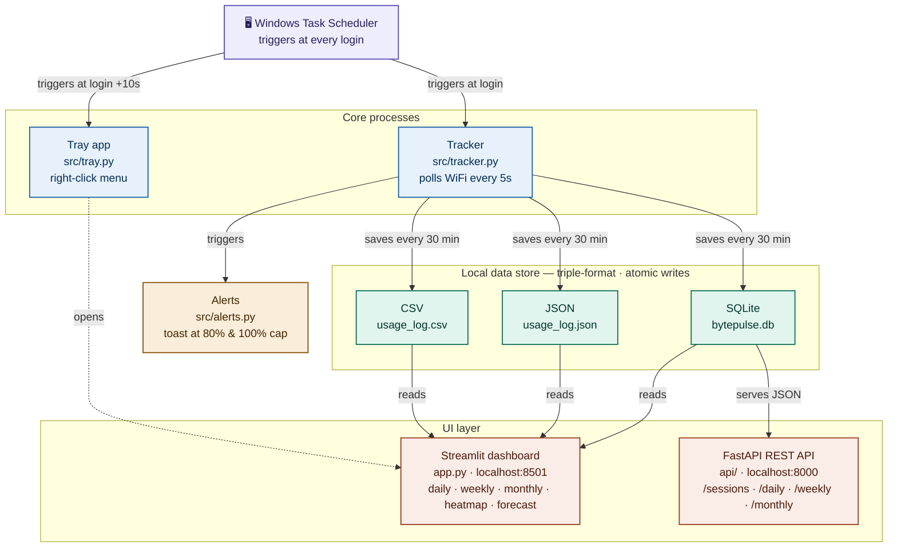

## Architecture

```mermaid
graph TD
    classDef system fill:#EEEDFE,stroke:#534AB7,stroke-width:1.5px,color:#26215C;
    classDef core fill:#E6F1FB,stroke:#185FA5,stroke-width:1.5px,color:#042C53;
    classDef data fill:#E1F5EE,stroke:#0F6E56,stroke-width:1.5px,color:#04342C;
    classDef alerts fill:#FAEEDA,stroke:#854F0B,stroke-width:1.5px,color:#412402;
    classDef ui fill:#FAECE7,stroke:#993C1D,stroke-width:1.5px,color:#4A1B0C;

    TaskSched["🖥 Windows Task Scheduler\ntriggers at every login"]:::system

    subgraph core ["Core processes"]
        Tracker["Tracker\nsrc/tracker.py\npolls WiFi every 5s"]:::core
        Tray["Tray app\nsrc/tray.py\nright-click menu"]:::core
    end

    subgraph store ["Local data store — triple-format · atomic writes"]
        CSV["CSV\nusage_log.csv"]:::data
        JSON["JSON\nusage_log.json"]:::data
        DB["SQLite\nbytepulse.db"]:::data
    end

    Alerts["Alerts\nsrc/alerts.py\ntoast at 80% & 100% cap"]:::alerts

    subgraph ui ["UI layer"]
        Streamlit["Streamlit dashboard\napp.py · localhost:8501\ndaily · weekly · monthly · heatmap · forecast"]:::ui
        FastAPI["FastAPI REST API\napi/ · localhost:8000\n/sessions · /daily · /weekly · /monthly"]:::ui
    end

    TaskSched -->|"triggers at login"| Tracker
    TaskSched -->|"triggers at login +10s"| Tray
    Tracker -->|"saves every 30 min"| CSV
    Tracker -->|"saves every 30 min"| JSON
    Tracker -->|"saves every 30 min"| DB
    Tracker -->|"triggers"| Alerts
    Tray -.->|"opens"| Streamlit
    CSV -->|"reads"| Streamlit
    JSON -->|"reads"| Streamlit
    DB -->|"reads"| Streamlit
    DB -->|"serves JSON"| FastAPI
```